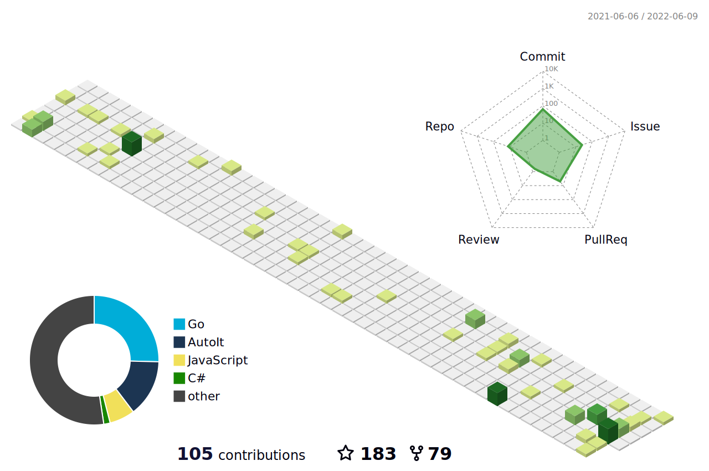

 ## Who Am I
 - a Gopher 
 - a rust beginner
 - a flutter & dart newbie
 - a cpp newbie
 - a .Net devloper

Please visit my github org [tiny-lib](https://github.com/tiny-lib) to see the code I have written
 
 I live in chengdu,China.
 
 
## Contact
- mail:root@czyt.tech
- [blog](https://czyt.tech)
---

<a href="https://next.ossinsight.io/widgets/official/compose-currently-working-on?user_id=19337206&activity_type=all" target="_blank" style="display: block" align="center">
  <picture>
    <source media="(prefers-color-scheme: dark)" srcset="https://next.ossinsight.io/widgets/official/compose-currently-working-on/thumbnail.png?user_id=19337206&activity_type=all&image_size=auto&color_scheme=dark" width="504.5" height="auto">
    
  </picture>
</a>

